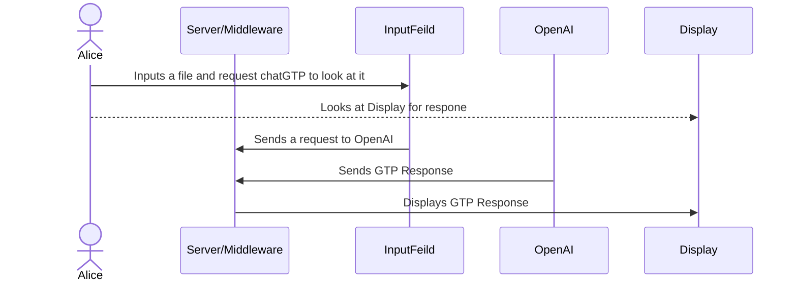

[](https://classroom.github.com/open-in-codespaces?assignment_repo_id=16933936)
<div align="center">

# SpeakSense
[](https://temple-cis-projects-in-cs.atlassian.net/jira/software/c/projects/DT/issues)
[](https://github.com/ApplebaumIan/tu-cis-4398-docs-template/actions/workflows/deploy.yml)
[](https://applebaumian.github.io/tu-cis-4398-docs-template/)


</div>


## Keywords
Speech-Analysis, Word Frequency Tracking, Progressive Web App, Speech Pattern Analysis, Word Detection, Voice Activation, Profanity Detection

## Project Description

**SpeakSense** is a progressive web application designed to provide real-time feedback on your speech. Whether you're preparing for a presentation, practicing for an interview, or refining a speech, SpeakSense helps you stay on track by monitoring your speech patterns and providing actionable insights.

### Key Features
- **Banned Words Alerts**: Add words or phrases (e.g., profanity, filler words) to your "banned words" list, and get alerted if you say them while speaking.
- **Statistics Dashboard**:
  - Tracks how often you've practiced.
  - Counts how many times you've said banned words.
  - Monitors how many days you've practiced.
- **AI Feedback**: Leverages AI to provide personalized feedback on your speech.

---

### Technologies Used
- **Frontend**: Next.js, React.js, TypeScript, JavaScript
- **APIs**:
  - Web API for speech recognition
  - OpenAI API for AI feedback
- **Database**: Dexie.js for local data management

---

### Challenges and Future Plans
- **Challenges**:
  - Integrating the OpenAI API was one of the most complex parts of this project. However, we successfully implemented it and look forward to enhancing its functionality.
  
- **Future Plans**:
  - Enable users to save their recordings and banned words to their profiles, so they don’t have to reconfigure them each time.
  - Shift from local storage (which currently deletes data on refresh) to persistent cloud-based storage.

---

SpeakSense is your personal speech improvement tool. Try it out and take your presentations, speeches, and interviews to the next level!

## Instructions for Installing and Running 

Here are instructions for installing on your local machine. 

### Step 1: Set Up the Project 
    Navigate to the project directory: 
   ```bash
    cd PWASetUp
    npm install 
    npm audit fix --force 
   ```

### Step 2: Set up GPT Functionality 
    Navigate to pages folders
    ```bash
    cd pages
    ```

    Run the Server”
    ```bash
    node chat.js 
    ```
    This will run the server and you should see a message on the terminal that the server is running

### Step 3: Install Dependencies to download for ChatGTP Sever:
    Run the following commands to install necessary dependencies: 
    ```bash
        npm i express
        npm i dotenv
        npm i cors
        npm i openai
    ```
### Step 4: Install other dependencies:
    Change back to PWASetUp
    
    NextUI: 
    ```bash
        npm install -g nextui-cli
        nextui add --all
    ```
    HeroIcons: 
    ```bash
        npm install @heroicons/react
    ```
    Charts: 
    ```bash
        npm i react-chartjs-2 chart.js
    ```

### Step 5: Run it!
        ```bash
        npm run dev
        ```
### Step 6: 
now you have SpeakSense on your local computer

## Conceptual Design

This is a template from Figma that is touched up. The intention is for the web app to also be accessible to mobile, but this gets the idea of what we want to display well.


## Use Cases
```mermaid
sequenceDiagram 
```
## UseCase 3:
 Getting GPT input from a speech file




## Collaborators

[//]: # ( readme: collaborators -start )
<table>
  <tr>
    <td align="center">
      <a href="https://github.com/JRheeTU">
        
        <br />
        <sub><b>Josh Rhee</b></sub>
      </a>
    </td>
    <td align="center">
      <a href="https://github.com/leighflagg">
        
        <br />
        <sub><b>Sophie Mettille</b></sub>
      </a>
    </td>
    <td align="center">
      <a href="https://github.com/Joshua-Varkey12">
        
        <br />
        <sub><b>Josh Varkey</b></sub>
      </a>
    </td>
    <td align="center">
      <a href="https://github.com/omarshakir8">
        
        <br />
        <sub><b>Omar Shakir</b></sub>
      </a>
    </td>
  </tr>
</table>

[//]: # ( readme: collaborators -end )
