[](https://classroom.github.com/open-in-codespaces?assignment_repo_id=16933936)
<div align="center">

# SpeakSense
[](https://temple-cis-projects-in-cs.atlassian.net/jira/software/c/projects/DT/issues)
[](https://github.com/ApplebaumIan/tu-cis-4398-docs-template/actions/workflows/deploy.yml)
[](https://applebaumian.github.io/tu-cis-4398-docs-template/)


</div>


## Keywords
Speech-Analysis, Word Frequency Tracking, Progressive Web App, Speech Pattern Analysis, Word Detection, Voice Activation, Profanity Detection

## Project Description
**SpeakSense** is a progressive web application designed to provide real-time feedback on your speech. Whether you're preparing for a presentation, practicing for an interview, or refining a speech, SpeakSense helps you stay on track by monitoring your speech patterns and providing actionable insights.

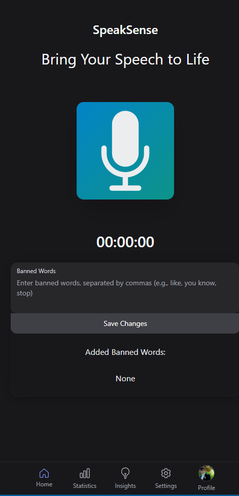
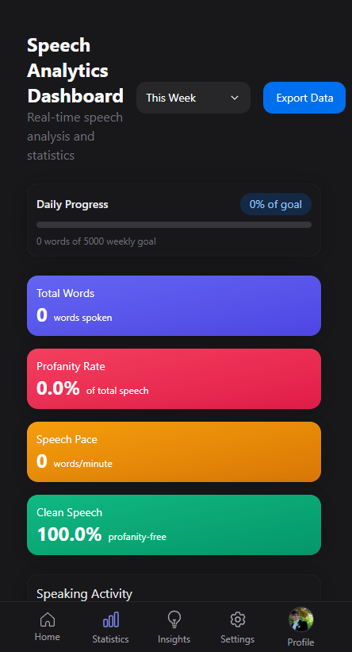
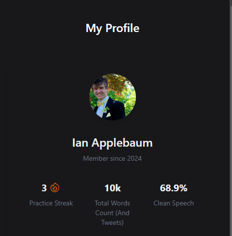


### Key Features
- **Banned Words Alerts**: Add words or phrases (e.g., profanity, filler words) to your "banned words" list, and get alerted if you say them while speaking.
- **Statistics Dashboard**:
  - Tracks how often you've practiced.
  - Counts how many times you've said banned words.
  - Monitors how many days you've practiced.
- **AI Feedback**: Leverages AI to provide personalized feedback on your speech.

---

### Technologies Used
- **Frontend**: Next.js, React.js, TypeScript, JavaScript
- **APIs**:
  - Web API for speech recognition
  - OpenAI API for AI feedback
- **Database**: Dexie.js for local data management

---

### Challenges and Future Plans
- **Challenges**:
  - Integrating the OpenAI API was one of the most complex parts of this project. However, we successfully implemented it and look forward to enhancing its functionality.
  
- **Future Plans**:
  - Enable users to save their recordings and banned words to their profiles, so they don’t have to reconfigure them each time.
  - Shift from local storage (which currently deletes data on refresh) to persistent cloud-based storage.

---

SpeakSense is your personal speech improvement tool. Try it out and take your presentations, speeches, and interviews to the next level!

## Instructions for Installing and Running 

Here are instructions for installing on your local machine. 

### Step 1: Set Up the Project 
    Navigate to the project directory: 
   ```bash
    cd PWASetUp
    npm install 
    npm audit fix --force 
   ```

### Step 2: Set up GPT Functionality 
Note: This requires a gpt key and .env file for GPT functionality

#### Step 2a: Install Dependencies to download for ChatGTP Sever:
    Run the following commands to install necessary dependencies: 
    ```bash
        npm i express
        npm i dotenv
        npm i cors
        npm i openai

#### Step 2b: Running the Server:
    Navigate to pages folders
    ```bash
    cd pages
    ```

    Run the Server”
    ```bash
    node chat.js 
    ```
    This will run the server and you should see a message on the terminal that the server is running
    ```
### Step 3: Install other dependencies:
    Change back to PWASetUp
    
    NextUI: 
    ```bash
        npm install -g nextui-cli
        nextui add --all
    ```
    HeroIcons: 
    ```bash
        npm install @heroicons/react
    ```
    Charts: 
    ```bash
        npm i react-chartjs-2 chart.js
    ```

### Step 4: Run it!
        ```bash
        npm run dev
        ```
### Step 5 Open SpeakSense: 
Click and open the link:
"https://localhost:3000" <br/>
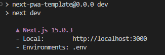

### Step 6: Installing SpeakSense:
Select the download icon in the search bar<br/>
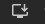 <br/>
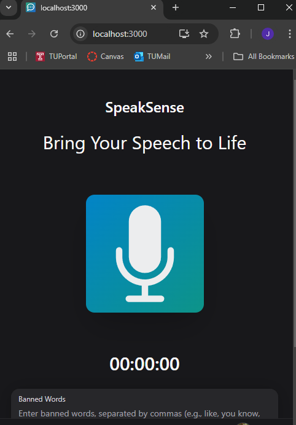 <br/>
This should prompt you to download SpeakSense, which should allow you to use the PWA properly!

## Use Cases

### Use Case 1
This sequence diagram highlights the user viewing the Statistics Page. After recording speech and saving word data, the user accesses the Statistics Page, which requests word data from the database. The database returns insights, such as banned word counts (e.g., "like"), which are displayed to the user for analysis.
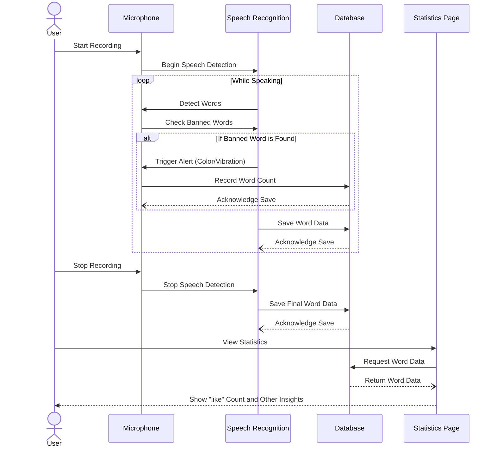

### Use Case 2:

This sequence diagram shows a user adding banned words, which are stored and displayed in the app. During speech recognition, the app detects these words in real-time, alerts the user, and updates the word count in the database.
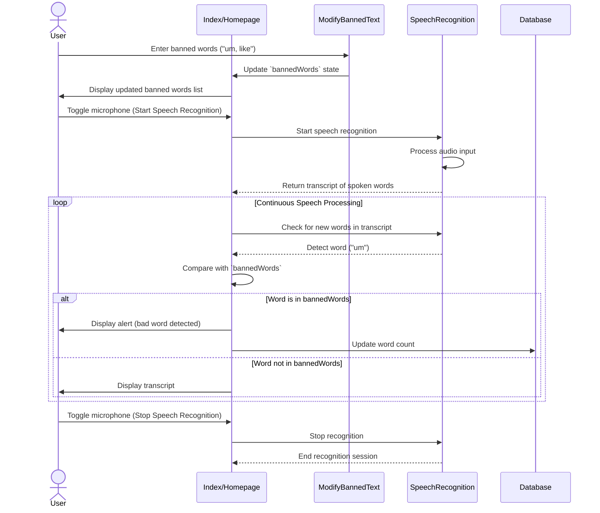
### Use Case 3:
 The user begins by recording their speech on the Index Page, where the AudioVisualizer captures the audio input and stores the transcript (fullTranscriptGlobal) in the database. The user then navigates to the Insights Page, which retrieves the transcript from the database and sends it to the server (chat.js) via a POST request. The server communicates with the OpenAI API, sending an analysis prompt and receiving AI feedback. The server then formats the analysis and sends it back to the Insights Page, where it is displayed to the user as analysis cards highlighting strengths, weaknesses, and other insights.


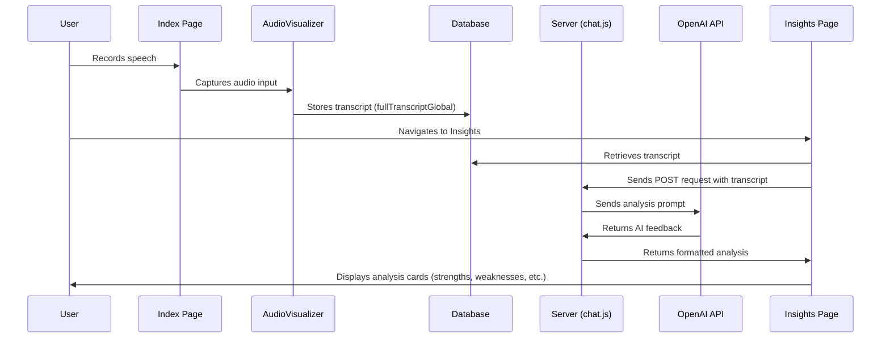
### Use Case 4

This Sequence diagram will go over how the user will go about deleting their personal data files associated with their speech patterns. In short, the user navigates to the page under settings called "Account Data" and selects and confirms their data deletion of their account, which then calls the function "deleetDatabase", which is a function in our database.js file, which deletes the data.

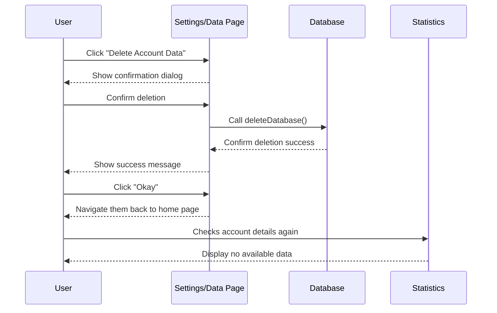
## Class Diagram 

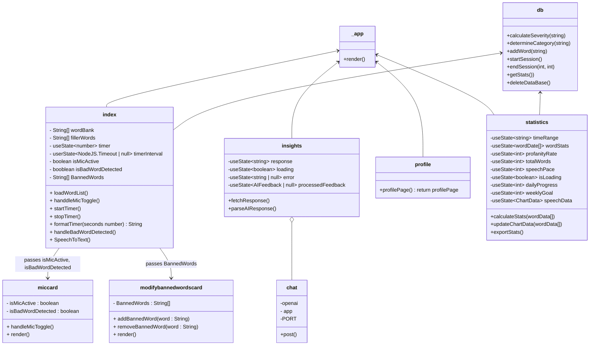
 
## Explaining key files and functions 

#_app.tsx

This is global wrapper for Next.js projects. This file runs the all of the diffrent files in the pages folder and makes sure that the styling is all the same. This file also makes sure you can render files dynamically. 

#index.tsx

This is the file that holds majority of the functionality go the PWA. This file leverages the browsers speech recognition API to collect user speech and give feed back based on if the user has said a badword or not. Some functions that help in this are VibrationsPattern(), SpeechToText(), and UpdateWordCount().

VibrationPattern():

This function adds the functionality of vibrating the phone or device. If the device is not able to vibrate it will throw an error saying that the device cannot support the function. 

SpeetchToText():

This function leverages the Web Speech API to process the live speech he user is saying to text. This function can also analyze the text and check it against the word bank of bad words. This function also updates the occurrence of how many times the user says a bad word. This occurrence of the bad word will trigger a vibration.

UpdateWordCount():

This function is an async function that helps the SpeechToText() function by checking the database of words and increasing a counter if a bad word is said.

#chat.js

This is the middleware that talks to openAI ChatGTP API. This will run in the background and make the API requests to openAI

#insights.tsx

This is the frontend that will display the response from chatGTP. This page is the users personal speach coach it will take the live speech that the user has said and give feed beack on diffrent measuring metrics.

#statistics.tsx

This file will display user statistics  like totalWords,  profanityRate, speechPace, wordStats. The user will be able to reflect on their word chocies by anaylaing the diffrent data that is collected.

#profile.tsx

This file allows the user to view their profile page and veiw some highlighted stats and profile image. This allows the user to feel more connted to the app.

#modify-Bannedwords.tsx

This file gives the user the functionality to modify the database and add their own banned words. With the added functinality users can add their own costume banned words to the list so that the app can help best fit their specific needs.

#Ring.js

This file give the app the functionality to play a sound while the user is saying a banned word. The uploaded sound is a fart noise right now but in the future we hope to add aditional functionality to allow the user to add their own sounds.

#AudioVisalizer.tsx

This file gives the app the functionality to visualize the sound waves of the users voice. The user will be able to see the fulcuation in the tone of voice however implmentation isnt implmented yet. 

#database.js

This is the database that will give the app the functionality to store words. This is a very important file becasue this holds the most functionality. All of the banned words that are used are stored here.

calculateSeverity():

This views the word that the user is saying and calculates the severity by comparing it to diffrent metrics that the algoritium uses. 

determineCategory():

This function views the speech and filters it into difffent categories such as filler words. Some examples of filler words are 'like', and 'um'.  

addWord():

calling this function will add a new word sand update the existing word count. 

startSession():

calling this function will start a new listening session. 

endSession(): 

calling this function will end the listening session. 

getStats():

calling this function will calculate statistics for a given time period.


## Collaborators

[//]: # ( readme: collaborators -start )
<table>
  <tr>
    <td align="center">
      <a href="https://github.com/JRheeTU">
        
        <br />
        <sub><b>Josh Rhee</b></sub>
      </a>
    </td>
    <td align="center">
      <a href="https://github.com/leighflagg">
        
        <br />
        <sub><b>Sophie Mettille</b></sub>
      </a>
    </td>
    <td align="center">
      <a href="https://github.com/Joshua-Varkey12">
        
        <br />
        <sub><b>Josh Varkey</b></sub>
      </a>
    </td>
    <td align="center">
      <a href="https://github.com/omarshakir8">
        
        <br />
        <sub><b>Omar Shakir</b></sub>
      </a>
    </td>
  </tr>
</table>

[//]: # ( readme: collaborators -end )
