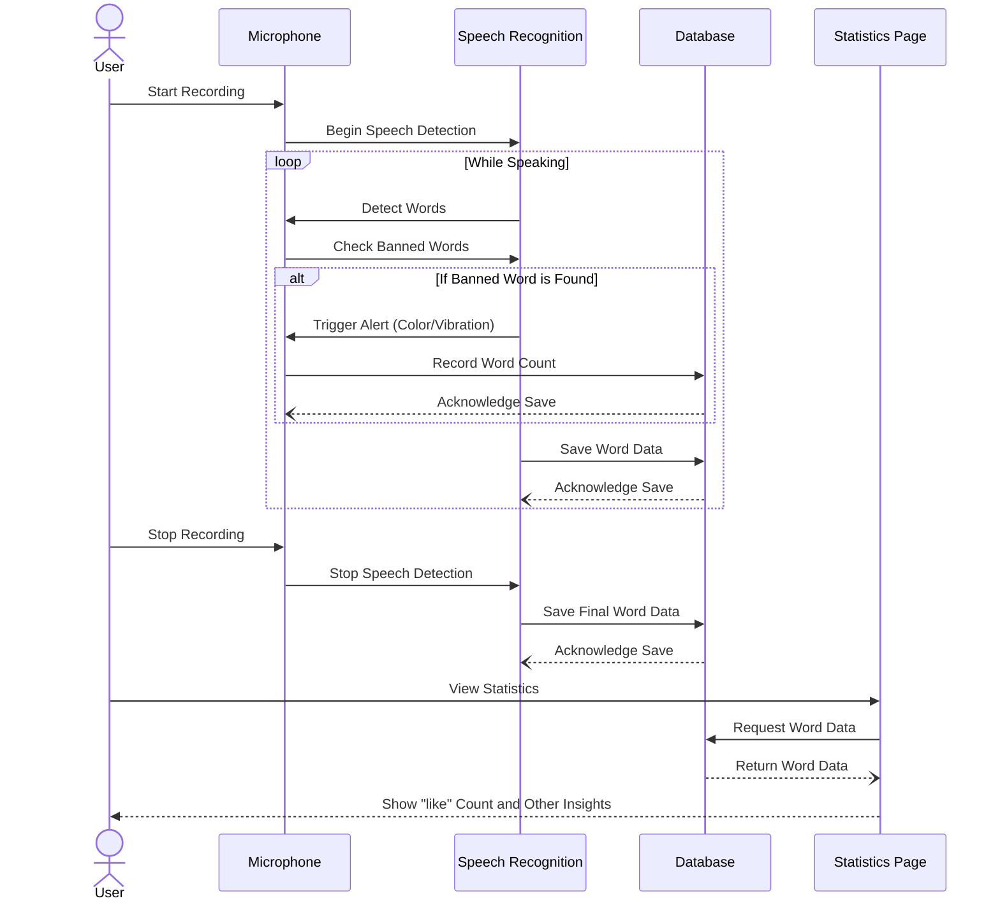
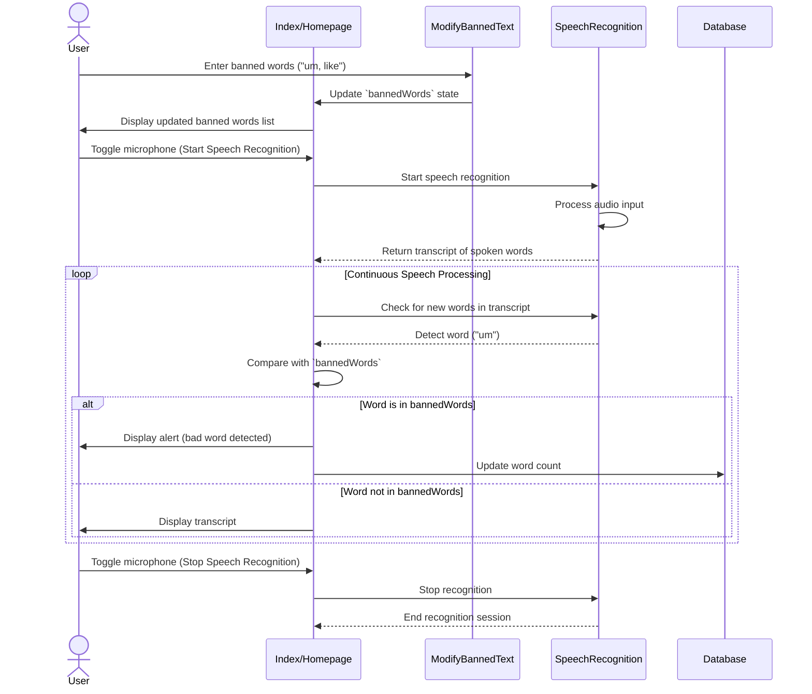

[](https://classroom.github.com/open-in-codespaces?assignment_repo_id=16933936)
<div align="center">

# SpeakSense
[](https://temple-cis-projects-in-cs.atlassian.net/jira/software/c/projects/DT/issues)
[](https://github.com/ApplebaumIan/tu-cis-4398-docs-template/actions/workflows/deploy.yml)
[](https://applebaumian.github.io/tu-cis-4398-docs-template/)


</div>


## Keywords
Speech-Analysis, Word Frequency Tracking, Progressive Web App, Speech Pattern Analysis, Word Detection, Voice Activation, Profanity Detection

## Project Description
**SpeakSense** is a progressive web application designed to provide real-time feedback on your speech. Whether you're preparing for a presentation, practicing for an interview, or refining a speech, SpeakSense helps you stay on track by monitoring your speech patterns and providing actionable insights.

### Key Features
- **Banned Words Alerts**: Add words or phrases (e.g., profanity, filler words) to your "banned words" list, and get alerted if you say them while speaking.
- **Statistics Dashboard**:
  - Tracks how often you've practiced.
  - Counts how many times you've said banned words.
  - Monitors how many days you've practiced.
- **AI Feedback**: Leverages AI to provide personalized feedback on your speech.

---

### Technologies Used
- **Frontend**: Next.js, React.js, TypeScript, JavaScript
- **APIs**:
  - Web API for speech recognition
  - OpenAI API for AI feedback
- **Database**: Dexie.js for local data management

---

### Challenges and Future Plans
- **Challenges**:
  - Integrating the OpenAI API was one of the most complex parts of this project. However, we successfully implemented it and look forward to enhancing its functionality.
  
- **Future Plans**:
  - Enable users to save their recordings and banned words to their profiles, so they don’t have to reconfigure them each time.
  - Shift from local storage (which currently deletes data on refresh) to persistent cloud-based storage.

---

SpeakSense is your personal speech improvement tool. Try it out and take your presentations, speeches, and interviews to the next level!

## Instructions for Installing and Running 

Here are instructions for installing on your local machine. 

### Step 1: Set Up the Project 
    Navigate to the project directory: 
   ```bash
    cd PWASetUp
    npm install 
    npm audit fix --force 
   ```

### Step 2: Set up GPT Functionality 
    Navigate to pages folders
    ```bash
    cd pages
    ```

    Run the Server”
    ```bash
    node chat.js 
    ```
    This will run the server and you should see a message on the terminal that the server is running

### Step 3: Install Dependencies to download for ChatGTP Sever:
    Run the following commands to install necessary dependencies: 
    ```bash
        npm i express
        npm i dotenv
        npm i cors
        npm i openai
    ```
### Step 4: Install other dependencies:
    Change back to PWASetUp
    
    NextUI: 
    ```bash
        npm install -g nextui-cli
        nextui add --all
    ```
    HeroIcons: 
    ```bash
        npm install @heroicons/react
    ```
    Charts: 
    ```bash
        npm i react-chartjs-2 chart.js
    ```

### Step 5: Run it!
        ```bash
        npm run dev
        ```
### Step 6: 
now you have SpeakSense on your local computer

## Conceptual Design

This is a template from Figma that is touched up. The intention is for the web app to also be accessible to mobile, but this gets the idea of what we want to display well.


## Use Cases

### Use Case 1
This sequence diagram highlights the user viewing the Statistics Page. After recording speech and saving word data, the user accesses the Statistics Page, which requests word data from the database. The database returns insights, such as banned word counts (e.g., "like"), which are displayed to the user for analysis.


### Use Case 2:

This sequence diagram shows a user adding banned words, which are stored and displayed in the app. During speech recognition, the app detects these words in real-time, alerts the user, and updates the word count in the database.

### Use Case 3:
 This sequence diagram illustrates the process of a user uploading a file and requesting a response from OpenAI. The user inputs the file and request through an input field and views the display for the response. The input is sent to the server, which communicates with OpenAI. OpenAI processes the request, sends back a response to the server, and the server displays it to the user.


```mermaid
sequenceDiagram

    actor User
    participant D as Insights Screen
    participant I as InputFeild
    participant S as Server/Middleware
    participant O as OpenAI
    
    User ->> I: Inputs a file and request chatGTP to look at it
    User ->>+ D: Looks at Insights for respone
    I ->> S: Sends a request to OpenAI
    S ->>+ O: Sends request
    O -->>- S: returns request
    S -->> D: Displays Request
    D ->>- Alice: Can veiw response on Insights screen
 
````
### Use Case 4: 
Data Deletion<br>
This Sequence diagram will go over how the user will go about deleting their personal data files associated with their speech patterns. In short, the user navigates to the page under settings called "Account Data" and selects and confirms their data deletion of their account, which then calls the function "deleetDatabase", which is a function in our database.js file, which deletes the data.

```mermaid
sequenceDiagram
    participant User
    participant UI as Settings/Data Page
    participant Database

    User->>UI: Click "Delete Account Data"
    UI-->>User: Show confirmation dialog
    User->>UI: Confirm deletion
    UI->>Database: Call deleteDatabase()
    Database-->>UI: Confirm deletion success
    UI-->>User: Show success message
    User->>UI: Click "Okay"
    UI-->>User: Navigate them back to home page
    User->>Statistics: Checks account details again
    Statistics-->>User: Display no available data

````

 
## Explaining key files and functions 

#index.tsx

This is the file that holds majority of the functionality go the PWA. This file leverages the browsers speech recognition API to collect user speech and give feed back based on if the user has said a badword or not. Some functions that help in this are VibrationsPattern(), SpeechToText(), and UpdateWordCount().

VibrationPattern():

This function adds the functionality of vibrating the phone or device. If the device is not able to vibrate it will throw an error saying that the device cannot support the function. 

SpeetchToText():

This function leverages the Web Speech API to process the live speech he user is saying to text. This function can also analyze the text and check it against the word bank of bad words. This function also updates the occurrence of how many times the user says a bad word. This occurrence of the bad word will trigger a vibration.

UpdateWordCount():

This function is an async function that helps the SpeechToText() function by checking the database of words and increasing a counter if a bad word is said.

#chat.js

This is the middleware that talks to openAI ChatGTP API. This will run in the background 

#insights.tsx

This is the frontend that will display the response from chatGTP. Users are also able to input textiles of the speech that they said and get detailed responses from ChatGTP.

#statistics.tsx

This file will display user statistics  like totalWords,  profanityRate, speechPace, wordStats

#profile.tsx

This file allows the user to view their profile page and veiw some highlight stats and profile image.

#modify-Bannedwords.tsx

This file gives the user the functionality to modify the database and add their own banned words.

#Ring.js

This file give the app the functionality to play a sound while the user isa saying a banned word 

#AudioVisalizer.tsx

This file gives the app the functionality to visualize the sound waves of the users voice.

#database.js

This is the database that will give the app the functionality to store words

calculateSeverity():

This views the word that the user is saying and calculates the severity by comparing it to a couple of severity lists

determineCategory():

This function views the speech and filters it into two categories called filter words, and technical terms. 

addWord():

This function will add a new word and update the existing word count 

startSession():

This will start a new listening session 

endSession(): 

This will end the listening session 

getStats():

This will calculate statistics for a given time period 


## Collaborators

[//]: # ( readme: collaborators -start )
<table>
  <tr>
    <td align="center">
      <a href="https://github.com/JRheeTU">
        
        <br />
        <sub><b>Josh Rhee</b></sub>
      </a>
    </td>
    <td align="center">
      <a href="https://github.com/leighflagg">
        
        <br />
        <sub><b>Sophie Mettille</b></sub>
      </a>
    </td>
    <td align="center">
      <a href="https://github.com/Joshua-Varkey12">
        
        <br />
        <sub><b>Josh Varkey</b></sub>
      </a>
    </td>
    <td align="center">
      <a href="https://github.com/omarshakir8">
        
        <br />
        <sub><b>Omar Shakir</b></sub>
      </a>
    </td>
  </tr>
</table>

[//]: # ( readme: collaborators -end )
