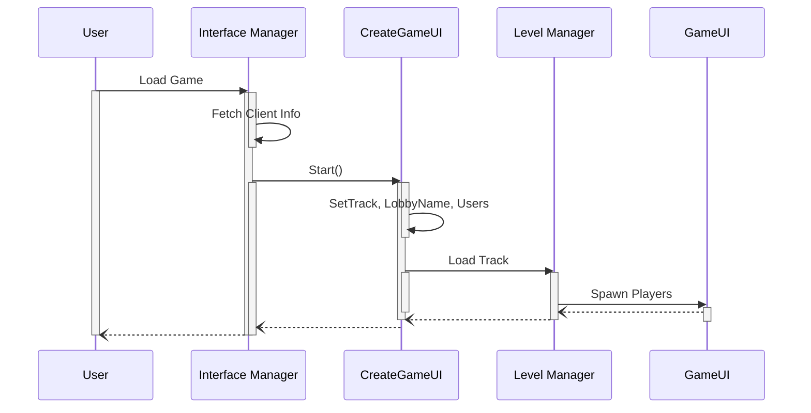
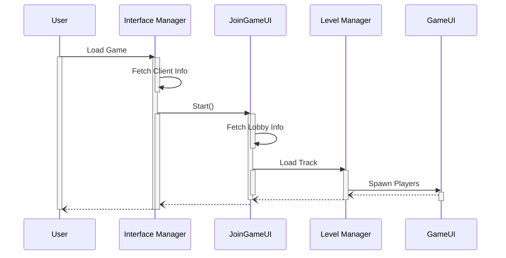
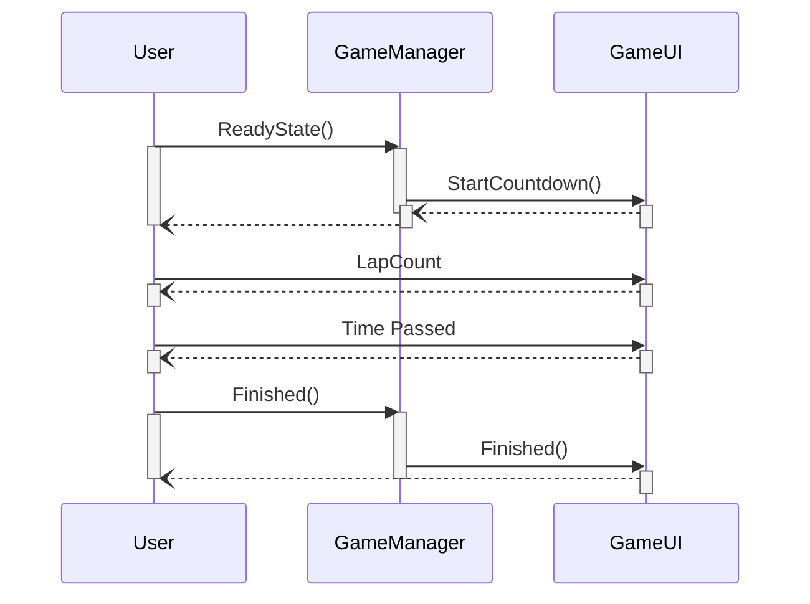

# Bassline Burn

## Keywords

Section 5, Top Down Pixel Driving Game made in Unity with C#.

## Project Abstract

This videogame introduces an interesting game mechanic of a live radio system affecting in game factors, like car max speed, acceleration, and turning power. To support this crisp mechanic, the game will feature a multiplayer system in which you and your friends can pick from an array of race courses based on real locations around the world and race eachother to see who is the best driver.

## High Level Requirement

This game has very simple parts but can get very complicated quickly. A lot of this is because of the multiplayer aspect of the game. For this reason, I think tackling the easy parts first like the base game then moving on to the multiplayer later will create a concise schedule that will allow us to make a smooth feeling game. On my own time I will attempt to create some art assests in order to make the game feel like our own and truly unique.

## Conceptual Design

The conceptual design involves creating a basic multiplayer racing game with Unity and C# and then building off of that. Once when we create amazing controls and this state of the art radio system, we can build off of this by adding a lobby to hold our multiplayer in which racers can vote on maps and even add bots to their game if there are not enough players. While to start we will just have a simple host/join multiplayer system, I would like to add on a system that will add you to a random game that has some players in it already.

### Sequence Diagram for Hosting a Game:

### Sequence Diagram for Joining a Game:

### Sequence Diagram for Game Loop

## Background

Growing up one of the most popular video games were Mariokart. Something about the fun controls made it entertaining for both the casual and hardcore racers. Now that I am a lot older, I want to replicate the game and combine it with my other interest in music. Live radios in games is not a new thing, from Forza to GTA, these games have all had in game radios. What will make this different is the fact that the radio actually affects the games and is not just an extra feature.

## Required Resources

This project just requires Unity and an IDE to edit C# code in. There are a vast amount on optional resources, like a way to create art and music, and a platform to post the final game with.

## Collaborators

[//]: # ( readme: collaborators -start )
<table>
<tr>
    <td align="center">
        <a href="https://github.com/ChristopherBrousseau">
            
             
            <b>Christopher Brousseau</b>
        </a>  
    </td>
    <td align="center"> 
        <a href="https://github.com/glantig1">
            
             
            <b>Gabriel Lantigua</b>
        </a> 
    </td>
    <td align="center"> 
        <a href="https://github.com/Random76520">
            
             
            <b>Jonathan Augustin</b>
        </a> 
    </td>
    <td align="center"> 
        <a href="https://github.com/Gunlords">
            
             
            <b>Ankur Chowdhury</b>
        </a> 
    </td>
    <td align="center"> 
        <a href="https://github.com/tus40499">
            
             
            <b>Jack Martin</b>
        </a> 
    </td>
    
    

</table>

[//]: # ( readme: collaborators -end )
