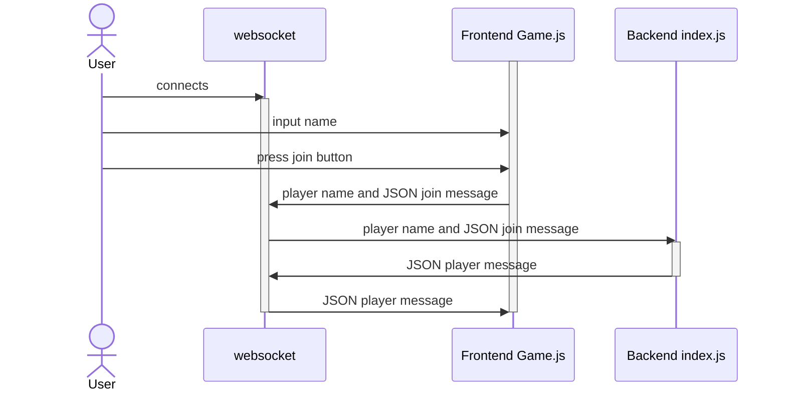
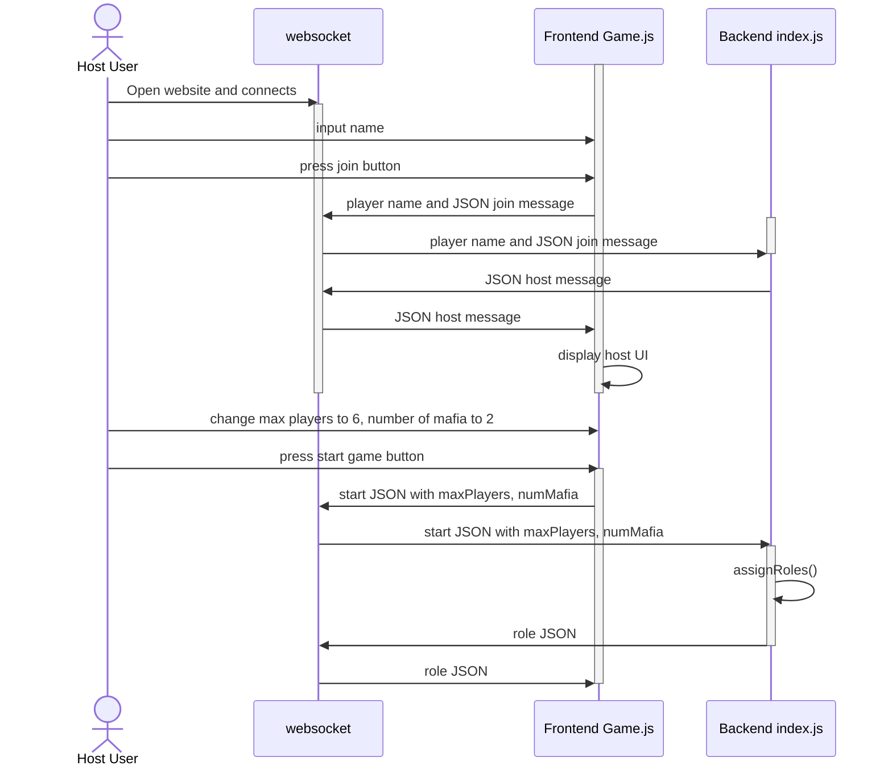

# Mafia Uhh

## Use Case 1: Player Joining The Game

This sequence diagram shows a player joining the game. First the user will open the website and that will make a websocket connection. Then the User will input their name and press the join button on the frontend client screen Game.js. The Frontend Game.js sends this information to the websocket connection and then the websocket will send that information to the backend index.js. The Backend index.js will send the player message to the websocket connection, which will then send it to the Frontend Game.js where it will be displayed on the client.

## Use Case 2: Host Changing Options in Host Panel

This sequence diagram is for the use case of the Host, or the first person to connect to the game, changing options in the host options panel. The host user opens the website and connects to the websocket. The host enters their name and presses join, which causes the frontend to send a join message containing the player name to the backend. Since this is the first user to join, they are made the host. The backend sends a host message to the frontend via the websocket, which then triggers the frontend to display the host UI for the host only. Then the host changes max players to 6 and number of mafia to 2. Once they start the game, a start message is sent via websocket to the backend, where these variables are used to assignRoles() to all players. Using the websocket, the backend sends a role message to the frontend to display the role that each player got.

## Features
- localhost hosting for testing
- pictures for each role (civilian/mafia)
- help button that opens a menu that describes each role
- ability to input your name when joining the game
- ability to start the game
- timer display while voting
- voting functionality
- first player to join becomes the host
- the game can assign roles to the players
- backend structure for game phases

## Keywords

Section #, as well as any words that quickly give your peers insights into the application like programming language, development platform, type of application, etc.

## Project Abstract

This document proposes a novel application of a text message (SMS or Email) read-out and hands-free call interacted between an Android Smartphone and an infotainment platform (headunit) in a car environment. When a phone receives an SMS or Email, the text message is transferred from the phone to the headunit through a Bluetooth connection. On the headunit, user can control which and when the received SMS or E-mail to be read out through the in-vehicle audio system. The user may press one button on the headunit to activate the hands-free feature to call back the SMS sender.

## High Level Requirement

Describe the requirements – i.e., what the product does and how it does it from a user point of view – at a high level.

## Conceptual Design

Describe the initial design concept: Hardware/software architecture, programming language, operating system, etc.

## Background

The background will contain a more detailed description of the product and a comparison to existing similar projects/products. A literature search should be conducted and the results listed. Proper citation of sources is required. If there are similar open-source products, you should state whether existing source will be used and to what extent. If there are similar closed-source/proprietary products, you should state how the proposed product will be similar and different.

## Required Resources

Discuss what you need to develop this project. This includes background information you will need to acquire, hardware resources, and software resources. If these are not part of the standard Computer Science Department lab resources, these must be identified early and discussed with the instructor.

## Collaborators

[//]: # ( readme: collaborators -start )
<table>
<tr>
    <td align="center">
        <a href="https://github.com/ApplebaumIan">
            
             
            <b>Ian Tyler Applebaum</b>
        </a>
    </td>
    <td align="center">
        <a href="https://github.com/leighflagg">
            
             
            <b>Null</b>
        </a>
    </td></tr>
</table>

[//]: # ( readme: collaborators -end )
